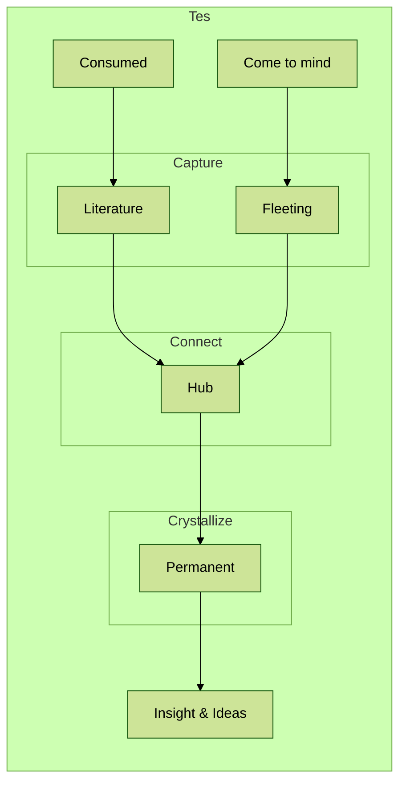

javascript

```javascript
export async function getSlugs() {
  const suffix = '.mdx'
  const files = await readdir('contents/posts')
  return files
    .filter((file) => file.endsWith(suffix))
    .map((file) => file.slice(0, -suffix.length))
}
```

> pls reload if flowchart not loaded


